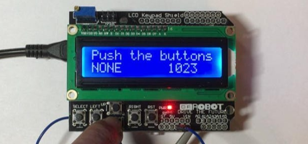
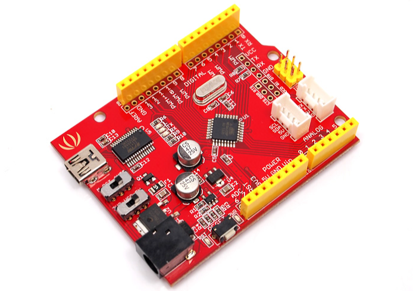
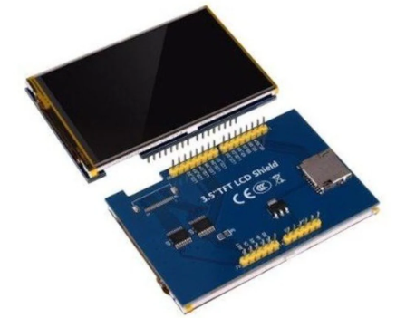
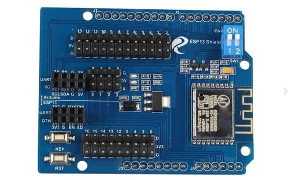
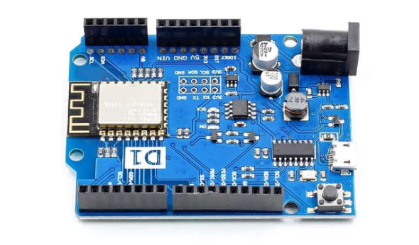
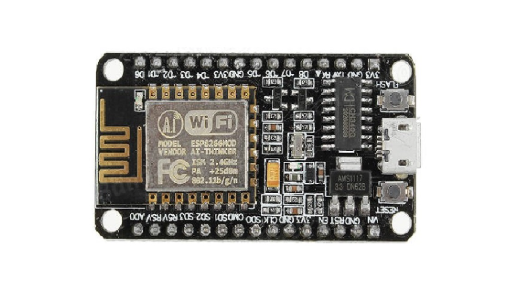

# 아두이노 가지고 놀기

## LCD Keypad Shield



[LCD Keypad](https://github.com/hugoMGSung/hungout-with-arduino/tree/main/LCDKeypad)

## Seeeduino 보드



[Seeeduino](https://wiki.seeedstudio.com/Seeed_Arduino_Boards/)
- 연결방법
	- Arduino IDE, Add BoardManager URL 추가
		- https://raw.githubusercontent.com/Seeed-Studio/Seeed_Platform/master/package_legacy_seeeduino_boards_index.json
	- 보드매니저 'Seeeduino Stalker V3' 검색 후 설치
	- Arduino IDE v2에서는 실패, 구버전 설치완료

## 3.5" TFT LCD Shield


[TFT](https://github.com/hugoMGSung/hungout-with-arduino/tree/main/TFT_LCD_Test)

- 연결방법
	- 아래 링크에서 압축다운로드
		- [library](http://www.lcdwiki.com/res/Program/Arduino/3.5inch/UNO_8BIT_ILI9486_MAR3501_V1.1/3.5inch_Arduino_8BIT_Module_ILI9486_MAR3501_V1.1.zip)
	- 스케지 > 라이브러리 포함하기 > .ZIP 라이브러리 추가
		
	
## ESP13 Shield


[참조경로](https://blog.naver.com/roboholic84/221139049600)
[깃헙소스](https://github.com/hugoMGSung/hungout-with-arduino/tree/main/WifiShield_Test)

***웹서버 실드***

- 연결방법 - 링크 추가보드 관리자 URL 추가
	- http://arduino.esp8266.com/stable/package_esp8266com_index.json
	- 보드 관리자에서 'ESP8266' 검색 결과 by ESP8266 Community 다운로드
	- 보드는 NodeMCU 1.0 (ESP-12E Module) 선택
	- 예제의 ESP8266Webserver > HelloServer 선택

- 와이파이 설정
	- DoitWifi_ESP13 와이파이에 연결
	- 192.168.4.2, Gateway 192.168.4.1
	- 브라우저 설정에서 Network Setting 변경			
	


192.168.4.1 접속 브라우저


여기 설정에서는 Station을 아래와 같이 변경함


필요한 설정 - Station의 DHCP 대신 아이피 설정, Network Setting의 Socket Type, Remote IP (Station IP Address와 동일하게 설정), Local Port 9000 -> 9090 등 빈번호로 설정

- 쉴드의 스위치를 ON 해야 데이터가 넘어옴


  
- ~~컴파일시 결과~~


~~현재 A fatal esptool.py error occurred: Failed to connect to ESP8266: Timed out waiting for packet header 라는 오류로 업로드는 성공했지만 나머지는 실패~~


- 다음 작업
	- 아두이노(서버 측) 로 데이터 전달 후 컨트롤

## P4S-348 Shield

아두이노용 PHPoC 쉴드는 아두이노를 이더넷 및 와이파이 네트워크로 연결시켜 줍니다. 아두이노 위에 이 쉴드를 장착하고 랜케이블을 연결한 후 간단한 네트워크 설정만 거치면 아두이노를 인터넷에 연결할 수 있습니다. 무선랜을 사용하기 위해서는 무선랜 동글을 연결하면 됩니다. 

- 연결방법 - 실드 연결 후 동글이 삽입(기존 동글이가 있어야 함)

## 1Channel Relay 
[링크](https://github.com/hugoMGSung/hungout-with-arduino/tree/main/Relay1Ch_Test)

## SmartHome 키트 클로닝
[SmartHome Kit](https://github.com/hugoMGSung/hungout-with-arduino/tree/main/SmartHomeDIY)

- 문제: 현재 SmartHome 소스를 Arduino R4 Wifi에서 동작시키면 avr/io.h 문제가 발생. R4에선 R3의 코드 호환 안되는 문제
- 해결방법: R3 Wifi 호환보드로 변경 예정

## Arduino R4 Wifi 테스트

- [Getting Started with UNO R4 WiFi](https://docs.arduino.cc/tutorials/uno-r4-wifi/r4-wifi-getting-started/)

	- 공식 사이트에 있는 Tetris Animation Sketch 테스트
	
	

- [RTC 테스트](https://docs.arduino.cc/tutorials/uno-r4-wifi/rtc/)

	- 공식 사이트 제공
	
	
	
- [UNO R4 WiFi Network Examples](https://docs.arduino.cc/tutorials/uno-r4-wifi/wifi-examples/)

	- 공식 사이트 제공
	- 현재 제품을 사용하는 궁극적인 목적
	- WifiS3 내장 라이브러리 사용
	
	[전체소스](https://github.com/arduino/ArduinoCore-renesas/blob/main/libraries/WiFiS3/examples/AP_SimpleWebServer/AP_SimpleWebServer.ino)
	
	- 현재 Access Point 부터 동작불가. 구글링 결과 
	[Update the connectivity module firmware on UNO R4 WiFi](https://support.arduino.cc/hc/en-us/articles/9670986058780-Update-the-connectivity-module-firmware-on-UNO-R4-WiFi) 진행 언급함
	
	
	
	그래도 안됨
	
	
- [Connect With WPA](https://github.com/arduino/ArduinoCore-renesas/blob/main/libraries/WiFiS3/examples/ConnectWithWPA/ConnectWithWPA.ino)

	성공!
	
	
	
	아두이노의 MAC 주소를 확인해둬야 함 (현재, 48:27:E2:E6:53:18) 
	
	
- [Scan Networks](https://github.com/arduino/ArduinoCore-renesas/tree/main/libraries/WiFiS3/examples/ScanNetworks)

	아래의 메시지가 10초에 한번씩 출력
	
	```shell
	SSID: san302
	BSSID: 70:5D:CC:E9:CF:32
	신호강도 (RSSI):-46
	암호화 타입:2
	```
	
- [Simple Webserver](https://github.com/arduino/ArduinoCore-renesas/tree/main/libraries/WiFiS3/examples/SimpleWebServerWiFi)
	
	ping 연결은 되는데 웹브라우저 연결안됨. 아두이노를 클라이언트로 서버에 연결하도록 해야할 듯

## WeMos D1 R1 Wifi



- 환경설정 - 추가보드매니저 URL에 
	- http://arduino.esp8266.com/stable/package_esp8266com_index.json 입력
	
	
	
- Wemos_WebServer 
	- 컴파일 및 업로드 후 
	- 시리얼 모니터 확인
	
	
	
	- 웹브라우저에 URL 입력
	
	

## 블루투스 통신
- 일반 아두이노에서 진행할 것
	- Wemos나 Wizfi250 등에서는 제대로 처리안되는 것 확인

- HC-06 블루투스 이름변경
	- Bluetooth_Exam 소스를 업로드 후 시리얼모니터에서 line ending 없음으로, 9600보드레이트로 설정
	- AT를 입력하면 OK 리턴
	- 명령줄에 AT+NAME**HugoDustBT** 등으로 변경

	

	
	

## NodeMCU 개발환경 구축



- Arduino IDE 환경설정에서 
	- http://arduino.esp8266.com/stable/package_esp8266com_index.json 추가

	

## Arduino Nano 확장실드 예제
[참조](https://www.youtube.com/watch?v=4y5BeVZaUKA)
- Arduino Nano
	- Adafruit Motor Library
	- LiquidCrystal I2C 설치

 	https://github.com/hugoMGSung/hungout-with-arduino/assets/59336331/3239b3fb-8df2-4622-aeec-22fa17139aff


## OrangeBoard Wifi

- https://github.com/Wiznet/WizFi250_arduino_library
	- Arduino IDE에서 라이브러리관리 WizFi250 검색 후 설치
	
